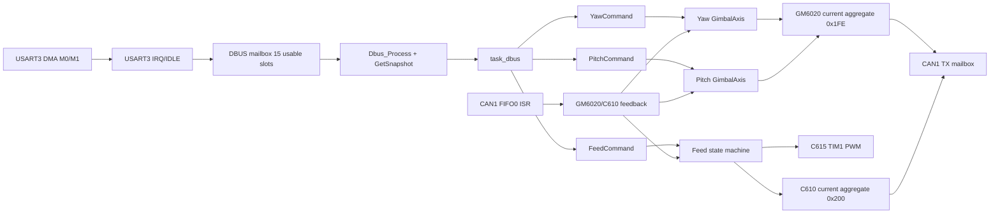

# yuntai 技术架构与算法说明

> **文档状态**：与源码同步的设计说明，2026-10-07。参数以 `Core/Inc/**/**_config.h` 和 BSP 头文件为准；台架尚未确认的机械量保留“待实测”标记。
>
> **适用范围**：STM32F407、HAL、FreeRTOS、CAN 电机、DJI DBUS、TIM1 PWM 和 USART1 DMA 日志组成的当前 `yuntai` 工程。

这份文档回答三个问题：系统由哪些层组成、每个控制周期如何把输入变成硬件输出、配置宏改变的是哪条公式或哪条安全路径。模块级接口仍以 `doc/modules/**/README.md` 和头文件注释为准；本文件负责串起跨模块的数据流。

## 1. 设计基线与代码地图

工程的调用方向是：任务组合应用和驱动，应用组合纯算法与驱动；纯算法不依赖 HAL、CAN 或 FreeRTOS。启动层只负责把这些组件按硬件生命周期连接起来：

```text
任务适配（DBUS/Yaw/Pitch/Feed 命令、参数和周期）
      ↓ 调用
应用控制（GM6020 单轴、级联控制） ─────┐
      ↓ 调用                           │
纯算法（PID、Ramp、低通、角度补偿、鼠标虚拟摇杆）
      ↑                                 │
BSP 驱动（CAN、DBUS、TIM1、日志） ◄────┘
      ↑
CubeMX/HAL 外设
```

其中“纯算法”同时被任务适配层直接调用（例如 DBUS 的鼠标虚拟摇杆），上图箭头表示运行时调用，而不是要求所有 C 头文件形成单向包含图。

主要目录与职责：

| 层 | 目录 | 作用 | 不负责的内容 |
|---|---|---|---|
| 生成入口 | `Core/Src/main.c`、`freertos.c`、`*.ioc` | 初始化外设、创建任务、启动调度器 | 业务控制算法 |
| CAN BSP | `Core/Src/bsp/can`、`c610_m2006`、`gm6020` | 收发协议、反馈解码、注册表、在线门 | 位置环和机械判定 |
| 输入 BSP | `Core/Src/bsp/dbus` | USART3 DMA 双缓冲、DBUS 帧校验和快照 | 轴目标计算 |
| PWM BSP | `Core/Src/bsp/snail_2305` | TIM1 CH1/CH2、C615 脉宽范围和 Ramp | C615 实际转速闭环 |
| 纯算法 | `Core/Src/algorithm` | 只读数值输入，返回数值输出 | HAL、CAN、FreeRTOS |
| 云台应用 | `Core/Src/app/gimbal` | GM6020 连续角度、位置/速度环、限位和补偿组合 | 任务创建、DBUS 解析 |
| 任务 | `Core/Src/task` | 读取命令、取得快照、调用控制器和发送周期输出 | 在 ISR 中做耗时工作 |
| 日志 | `Core/Src/app/log` | USART1 DMA 单缓冲非阻塞发送 | 控制安全和任务调度 |

完整源文件由顶层 `CMakeLists.txt` 显式加入。新增业务 `.c` 必须同时加入该文件；CubeMX 管理文件的用户修改只放在 `USER CODE` 区域。

## 2. 启动、任务与调用关系

### 2.1 启动顺序

`main()` 执行以下顺序：

1. `HAL_Init()` 和时钟配置。
2. 初始化 GPIO、DMA、CAN1、USART1、USART3、TIM1。
3. 配置 CAN1 FIFO0 过滤器、启动 CAN、打开 `CAN_IT_RX_FIFO0_MSG_PENDING`。
4. `osKernelInitialize()`，由 `MX_FREERTOS_Init()` 创建 DBUS、Yaw、Pitch、供弹任务。
5. `osKernelStart()` 后，业务在任务和 CAN 中断中运行。

正式供弹和 C615 独立 PWM 测试启动时分别初始化所需的驱动；C610 角度步长测试只注册 CAN1 ID1 的 C610/M2006，不启动 C615。任一所需驱动初始化失败，任务保持停止输出并按 `FEED_MOTOR_INIT_RETRY_MS` 重试；不能把“句柄注册成功”当成“电机已经在线”。

### 2.2 周期任务表

| 任务 | 默认周期 | 输入 | 输出 | 时间基准 |
|---|---:|---|---|---|
| `task_dbus` | 2 ms | USART3 DMA 快照 | Yaw、Pitch、Feed 命令邮箱 | HAL ms + FreeRTOS Tick 调度 |
| `task_feed_motor` | 2 ms | DBUS 左键、C610 反馈 | C615 PWM、M2006 CAN 电流 | HAL ms 检查新鲜度；Tick 计阶段 |
| `task_yaw` | 2 ms | Yaw 命令、GM6020 反馈 | GM6020 ID1 电流 | HAL ms + 固定配置 `dt_ms=2` |
| `task_pitch` | 2 ms | Pitch 命令、GM6020 反馈 | GM6020 ID2 电流 | HAL ms + 固定配置 `dt_ms=2` |
| CAN FIFO0 ISR | 事件触发 | CAN 反馈帧 | 驱动反馈结构 | `HAL_GetTick()` 时间戳 |
| USART1 DMA 完成回调 | 事件触发 | DMA 状态 | 释放日志缓冲区 | ISR，仅做所有权释放 |

`vTaskDelayUntil()` 保持绝对唤醒点。供弹正式运行时通过前后 Tick 差计算实际 `dt_ms`；Yaw/Pitch 的任务入口直接向控制器传入配置周期 2 ms，当前没有测量迟到周期。这两种实现必须区分：云台发生调度超期时，目标积分、积分项和电流 Ramp 仍按 2 ms 计算，需要台架测量执行时间和调度抖动。

### 2.3 一次完整数据流

```text
DBUS DMA
  → HAL/USART 回调只记录帧
  → Dbus_Process() 解码并校验
  → Dbus_GetSnapshot()
  → task_dbus 每 2 ms 发布三份值快照
       ├─ YawCommand_Submit()
       ├─ PitchCommand_Submit()
       └─ FeedMotorCommand_Submit()

CAN FIFO0 中断
  → can_rx_dispatch.c 取出一帧
  → Gm6020_HandleRxMessage()
  → C610_M2006_HandleRxMessage()
  → 更新时间戳、反馈字段和连续角度

供弹任务
  → 命令年龄门 + C610 反馈年龄门
  → C615 脉宽 Ramp
  → 供弹状态机 + M2006 停滞确认
  → C610_M2006_SetCurrent()/SetOutputEnabled()
  → C610_M2006_SendAll() → CAN 0x200
```

任务只消费值副本。CAN ISR 不打印、不等待、不调用普通 FreeRTOS API；日志也不参与控制决策。

## 3. 两种时间和并发规则

工程有两个不能混用的时基：

| 时基 | 来源 | 用途 |
|---|---|---|
| HAL ms | `HAL_GetTick()` | DBUS 命令年龄、CAN 反馈年龄、反馈时间戳 |
| FreeRTOS Tick | `xTaskGetTickCount()` | `vTaskDelayUntil()`、供弹阶段计时、日志限频 |

毫秒配置在与 Tick 比较时必须写成 `pdMS_TO_TICKS(value_ms)`。即使当前 `configTICK_RATE_HZ=1000`，也不能依赖两者数值恰好相等。

时间差用无符号减法支持计数器回绕：

```c
uint32_t age = now - stamp;
if (age <= INT32_MAX && age >= timeout_ms) {
  /* 过期 */
}
```

如果 ISR 在取得 `now` 后写入了略新的时间戳，减法可能看起来像巨大下溢；代码将大于半个 `uint32_t` 周期的差值解释为 0 ms。时间戳为 0 ms 仍可能是有效首帧，必须使用 `feedback_received` 或 `g_received` 额外区分“未收到过”。

共享数据的规则：

- DBUS 命令邮箱：任务临界区复制 `enabled`、按钮和时间戳的完整结构。
- C610/GM6020 反馈：ISR 用奇偶 `feedback_sequence` 包住多字段更新，任务通过 `GetFeedback()`/`GetSnapshot()` 重试取得同一帧。
- C610 聚合发送：读取所有电机槽位、构建 8 字节帧、提交 HAL 邮箱处于同一短临界区；临界区内不等待、不打印。
- 日志 DMA：原子取得唯一缓冲区所有权，DMA 完成回调释放；忙或超长文本直接拒绝，下一周期重试。

## 4. CAN 协议与角度展开

### 4.1 C610/M2006

C610/M2006 使用标准 CAN、DLC=8：

| 帧 | ID | 内容 |
|---|---:|---|
| 控制低组 | `0x200` | ID1~4，每台占两个字节 |
| 控制高组 | `0x1FF` | ID5~8，每台占两个字节 |
| 反馈 | `0x200 + motor_id` | ID1 对应 `0x201` |

反馈字段均为大端：角度 `DATA[0:1]`、速度 `DATA[2:3]`、实际电流 `DATA[4:5]`。`DATA[6]` 按 C610 手册保留，`DATA[7]` 为错误码；保留字段不参与保护判断。

编码器一圈为 8192 count。ISR 每收到一帧执行：

```c
delta = angle_raw - previous_angle_raw;
if (delta > 4096)  delta -= 8192;
if (delta < -4096) delta += 8192;
angle_total_raw += delta;
```

这是假设相邻帧角位移小于半圈的最小回绕展开算法。它把 `8190 → 2` 解释为 `+4`，而不是 `-8188`。如果反馈丢帧导致实际位移超过半圈，方向不能唯一判断；这属于待实测的通信/速度边界。

C610 电流协议范围是 `[-10000, 10000]`，不能套用 GM6020/C620 的 `[-16384, 16384]`。`C610_M2006_SetCurrent()` 先钳位目标缓存；`SendAll()` 在反馈过期或输出未使能时强制槽位为零。

### 4.2 GM6020

GM6020 也使用 CAN 聚合帧，但电流协议范围是 `[-16384, 16384]`。Yaw 使用 GM6020 电调 ID1（反馈 `0x205`），Pitch 使用 ID2（反馈 `0x206`）。GM6020 反馈 ID 是 `0x204+电调编号`，与 C610 的 `0x200+编号` 不同。当前两轴电流聚合到 `0x1FE`，分别占 DATA[0:1] 和 DATA[2:3]；每轴拥有独立句柄和控制历史。

GM6020 反馈 DATA[6] 是温度，DATA[7] 是保留字节；C610 对这两个字节的定义不同。`GimbalAxis` 统一经过反馈新鲜度、标定和参数有效性检查，驱动发送前还检查新鲜度。协议温度被记录，并没有温度阈值保护。

## 5. 纯算法模块

### 5.1 PID：离散计算与抗积分饱和

`algorithm/pid/pid.c` 的输入误差单位由调用者定义，周期为秒：

\[
I_k=\operatorname{clamp}(I_{k-1}+K_i e_k\Delta t, I_{min}, I_{max})
\]
\[
u^*=K_p e_k+I_k+K_d\frac{e_k-e_{k-1}}{\Delta t}
\]
\[
u_k=\operatorname{clamp}(u^*,u_{min},u_{max})
\]

首帧把 `previous_error` 设为当前误差，避免默认上一误差为 0 导致微分尖峰。输出饱和时，只有能把输出拉回饱和区的积分方向才被保存，这就是抗积分饱和。

供弹 M2006 当前不使用 PID 或固定角度目标。单发/连发直接发送配置的固定供弹电流：

\[
I_{feed}=FEED\_MOTOR\_FEED\_CURRENT\_RAW\times FEED\_MOTOR\_CURRENT\_SIGN
\]

单发是否结束由连续角度的停滞窗口判定，不由位置误差或步长判定。电流仍受
`FEED_MOTOR_MAX_CURRENT_RAW` 和 C610 协议范围限制。

Yaw/Pitch 的速度内环使用完整 PID；位置外环的积分候选在目标速度饱和且误差仍向饱和方向时回退上一周期积分，避免“大误差一次积分后反向越限”。

### 5.2 Ramp：按速率限幅

`algorithm/ramp/ramp.c` 的目标、历史值和速率必须使用同一单位：

\[
\Delta_{max}=r\Delta t_s
\]
\[
x_k=x_{k-1}+\operatorname{clamp}(x^*-x_{k-1},-\Delta_{max},+\Delta_{max})
\]

C615 由 `1000~1520 us` 在 `300 ms` 内变化，速率为：

\[
r_{PWM}=\frac{1520-1000}{0.300}=1733.33\;us/s
\]

故障路径调用 `Snail2305_Stop()` 重建 Ramp 起点并立即写停止值；通信故障不能等待正常减速 Ramp。

### 5.3 一阶低通

速度滤波使用：

\[
y_k=y_{k-1}+\alpha(x_k-y_{k-1})
\]

`alpha` 越小，噪声越小但相位滞后越大。低通只能减小测速噪声，不能替代反馈年龄检查；反馈掉线时必须先走安全门。

### 5.4 鼠标虚拟摇杆

DBUS 鼠标字段是相对位移，不是绝对位置。算法为 X/Y 各保存独立状态：

1. 通过帧序号去重，重复快照不重复消费位移。
2. 新位移乘以 `gain_permille_per_count`，以浮点累加并钳位到输出上限。
3. 最后一帧非零事件后保持 `hold_ms`。
4. 在 `decay_ms` 内按绝对时间线性回中：
   
\[
v(t)=v_0\frac{T_{decay}-(t-T_{hold})}{T_{decay}}
\]

5. 离线、时间倒退、帧序号回退、NaN/Inf 或输出指针非法时清零全部状态。

当前 DBUS 鼠标参数来自 `task_dbus_config.h`：Yaw `0.5‰/count`、Pitch `0.9‰/count`，两轴保持 70 ms、回中 70 ms，总输出上限 660‰。这些值是手感参数，不是电机协议量。

## 6. 云台控制算法

### 6.1 命令到目标角度

Yaw/Pitch 接收的是 `[-1000,1000]‰` 的相对速度命令。命令速度换算为 rpm：

\[
v_{cmd}=\frac{p}{1000}V_{max}
\]

再按编码器一圈 8192 count 积分目标：

\[
q^*_k=q^*_{k-1}+v_{cmd}\frac{8192}{60}\Delta t_s
\]

零输入、命令失效或超时冻结最后目标；不会把目标重定位到当前反馈。反馈恢复时清 PID、滤波和 Ramp 历史，但保留目标，避免通信短暂中断造成跳位。

### 6.2 软件限位

在最小边界且命令继续减小，或在最大边界且命令继续增大时，代码同时屏蔽：

- 目标角度积分；
- 速度前馈。

反向命令同周期生效。越界反馈仍按普通闭环计算，不自动把目标改成当前位置。固定目标越界则整周期发零。

### 6.3 级联位置/速度环

位置外环输出目标速度：

\[
v^* = K_{p,pos}e + I_{pos}+K_{d,pos}\dot e + K_{ff}v_{cmd}
\]

其中：

\[
e=q^*-q
\]

目标速度先限幅到 `±MAX_SPEED_TARGET_RPM`，速度误差为：

\[
e_v=v^*-v_{filtered}
\]

速度内环 PID 输出 GM6020 电流：

\[
i_{loop}=PID(e_v,\Delta t_s)
\]

Pitch 还叠加重力补偿：

\[
i_g=s_g(B+A\cos(2\pi(q-q_c)/8192))
\]

`q-q_c` 使用 `int64_t` 求差后再取 8192 周期，避免大连续角度转成 float 后丢失小角差。最终电流：

\[
i=\operatorname{Ramp}\left(\operatorname{clamp}(i_{loop}+i_g,-I_{max},I_{max})\right)
\]

Yaw 默认关闭重力补偿；Pitch 当前默认偏置 4500 raw、幅值 1500 raw、补偿开启。补偿方向 `*_GRAVITY_CURRENT_SIGN` 与闭环电流方向独立。

### 6.4 当前 Yaw/Pitch 关键宏

| 参数组 | 宏 | 当前值 | 作用 |
|---|---|---:|---|
| 模式 | `*_HARDWARE_TEST_MODE` | 0 | 0 正式、1 只读标定、2 固定角度闭环 |
| 标定 | `*_CALIBRATION_VALID` | 1 | 未完成标定时正式输出保持为零 |
| 周期/超时 | `*_TASK_PERIOD_MS`、`*_COMMAND_TIMEOUT_MS`、`*_FEEDBACK_TIMEOUT_MS` | 2/100/100 | 调度、命令有效期、反馈安全门 |
| 输入速度 | `*_MAX_COMMAND_SPEED_RPM` | 40 | 满输入速度 |
| 目标速度 | `*_MAX_SPEED_TARGET_RPM` | Yaw 95 / Pitch 70 | 位置外环输出限幅 |
| 位置环 | `*_POSITION_KP/KI/KD_*` | 轴独立 | count→rpm 的外环增益、积分、阻尼 |
| 速度环 | `*_SPEED_KP/KI/KD_*` | 轴独立 | rpm→GM6020 raw 的内环增益 |
| 电流 | `*_MAX_CURRENT_RAW` | 7000 | GM6020 总输出限幅，协议上限 16384 |
| Ramp | `*_CURRENT_SLEW_RAW_PER_S` | 60000 | 电流最大变化率 |
| 滤波 | `*_SPEED_FILTER_ALPHA` | Yaw 0.20 / Pitch 0.15 | 速度低通权重 |
| 重力 | `PITCH_GRAVITY_*` | 开启、4500、1500 | Pitch 余弦补偿；Yaw 默认关闭 |

完整的轴独立宏和单位注释放在 `task_yaw_config.h`、`task_pitch_config.h`，不要在 BSP 中复制这些产品参数。

轴配置中的每个产品宏都落在下面四类之一：模式/标定决定是否允许闭环，输入/时序决定目标如何变化，级联增益决定误差如何变成速度和电流，补偿/日志决定附加电流和观测开销。

| 宏模式 | Yaw 当前值 | Pitch 当前值 | 直接进入的算法 |
|---|---:|---:|---|
| `*_HARDWARE_TEST_MODE_OFF/CALIBRATION/ANGLE_LOOP` | 0/1/2 | 0/1/2 | 编译期选择正式、只读标定或固定目标测试路径 |
| `*_HARDWARE_TEST_MODE` | OFF | OFF | 任务入口分支；测试路径与正式路径互斥 |
| `*_CALIBRATION_VALID` | 1 | 1 | `GimbalAxis_Init()` 的标定安全门；无效时发零 |
| `*_TASK_PERIOD_MS` | 2 | 2 | `vTaskDelayUntil()` 周期；Yaw/Pitch 控制器固定使用 2 ms，供弹正式路径另测实际 Tick 差 |
| `*_FEEDBACK_TIMEOUT_MS` | 100 | 100 | `HAL_GetTick()` 反馈年龄门；过期发零 |
| `*_COMMAND_TIMEOUT_MS` | 100 | 100 | 命令快照年龄；失效后以零速度保持目标 |
| `*_TASK_LOG_PERIOD_MS` | 500 | 500 | 正式任务日志成功发送后的限频 |
| `*_CALIBRATION_CENTER_ANGLE_RAW` | 2100 | 8753 | 重力补偿中心、固定目标相对中心和标定参考 |
| `*_CALIBRATION_MIN_ANGLE_RAW` | 115 | 8136 | 软件最小边界；向外负命令被过滤 |
| `*_CALIBRATION_MAX_ANGLE_RAW` | 4085 | 9350 | 软件最大边界；向外正命令被过滤 |
| `*_MOTOR_CURRENT_SIGN` | 1 | 1 | 控制器逻辑电流到物理 CAN 电流的符号 |
| `*_FEEDBACK_SPEED_SIGN` | 1 | 1 | 原始 rpm 到逻辑速度的符号 |
| `*_GRAVITY_COMPENSATION_ENABLE` | 0 | 1 | 是否计算余弦补偿；Yaw 关闭，Pitch 开启 |
| `*_GRAVITY_COMPENSATION_BIAS_CURRENT_RAW` | 0 | 4500 | 补偿模型的常值项 `B` |
| `*_GRAVITY_COMPENSATION_AMPLITUDE_CURRENT_RAW` | 0 | 1500 | 补偿模型的余弦幅值 `A` |
| `*_GRAVITY_CURRENT_SIGN` | 1 | 1 | 补偿电流独立于闭环电流的符号 |
| `*_MAX_COMMAND_SPEED_RPM` | 40 | 40 | `permille/1000 × Vmax` 的输入速度换算 |
| `*_VELOCITY_FEEDFORWARD_GAIN` | 1.2 | 0.8 | 位置环输出中的 `Kff × command_speed` |
| `*_MAX_SPEED_TARGET_RPM` | 95 | 70 | 位置外环目标速度限幅 |
| `*_POSITION_KP_RPM_PER_RAW` | 0.01 | 0.05 | 角度误差到目标 rpm 的比例项 |
| `*_POSITION_KI_RPM_PER_RAW_S` | 0 | 2 | 位置积分项，按 `error × dt_s` 累加 |
| `*_POSITION_INTEGRAL_LIMIT_RPM` | 5 | 5 | 位置积分限幅和目标速度饱和回退边界 |
| `*_POSITION_KD_RPM_S_PER_RAW` | 0 | 0 | `command_speed-filtered_speed` 形成的误差变化阻尼 |
| `*_SPEED_KP_CURRENT_PER_RPM` | 200 | 200 | 速度误差到 raw 电流的比例项 |
| `*_SPEED_KI_CURRENT_PER_RPM_S` | 20 | 20 | 速度 PID 积分项 |
| `*_SPEED_KD_CURRENT_S_PER_RPM` | 1.5 | 0 | 速度误差微分项；测速噪声大时会放大尖峰 |
| `*_SPEED_INTEGRAL_LIMIT_RAW` | 7000 | 7000 | 速度 PID 积分历史限幅 |
| `*_MAX_CURRENT_RAW` | 7000 | 7000 | 闭环与补偿合成后的轴电流限幅 |
| `*_CURRENT_SLEW_RAW_PER_S` | 60000 | 60000 | 合成电流进入 CAN 前的 Ramp 速率 |
| `*_SPEED_FILTER_ALPHA` | 0.20 | 0.15 | 一阶低通 `y += alpha × (x-y)` |
| `*_ANGLE_LOOP_TARGET_ANGLE_DEG` | 30 | 0 | 固定目标测试中相对中心的角度；换算为 count 后检查边界 |
| `*_ANGLE_LOOP_LOG_PERIOD_MS` | 200 | 200 | 固定目标测试日志限频 |
| `*_CALIBRATION_LOG_PERIOD_MS` | 200 | 200 | 只读标定角度日志限频 |
| `*_CALIBRATION_PROMPT_PERIOD_MS` | 3000 | 5000 | 标定操作提示限频，不参与电流控制 |

表中 `*` 代表 `YAW` 或 `PITCH`。例如把 `PITCH_POSITION_KP_RPM_PER_RAW` 从 0.05 调到 0.08，只改变“角度误差→目标速度”的比例项；它不会改变速度内环的 `PITCH_SPEED_KP_CURRENT_PER_RPM`，也不会改变最大电流。调整级联环时应先根据各级限幅计算饱和误差，再逐组修改。

## 7. 供弹系统：机械、状态机和公式

### 7.1 硬件组合

- C615 CH1：PE9/TIM1_CH1。
- C615 CH2：PE11/TIM1_CH2。
- TIM1：1 MHz 计数、20000 us 周期，即 50 Hz。
- M2006：CAN1、C610 ID1、反馈 `0x201`、控制 `0x200`。

C615 是开环 PWM：停止值、活动值和 Ramp 由供弹配置提供；代码只知道最近写入的 CCR，不知道真实转速。M2006 单发不再使用固定角度步长，而是以固定电流驱动，观察连续反馈位置是否停止变化。

### 7.2 命令和安全门

```text
command_enabled = DBUS有效
                && 命令未超过100 ms
                && C610 已收到新鲜反馈（<100 ms）
                && 供弹驱动初始化成功
```

鼠标左键只作为状态机输入。命令超时或反馈失效当周期立即清 M2006 电流并写停止脉宽；
短按释放不会中断正在进行的单发。连发释放左键当周期清零 M2006 电流，并将 C615 目标设为停止脉宽，PWM 按 Ramp 减速；命令/反馈失效直接写停止脉宽。

### 7.3 状态机

| 状态 | 进入条件 | 输出 | 离开条件 |
|---|---|---|---|
| `STOP` | 无活动请求、单发结束且已松键、命令/反馈失效 | M2006=0；C615 停止 | 左键新的按下沿且安全门有效 |
| `FRIC_SPINUP` | 左键按下沿 | M2006=0；C615 Ramp 到活动值 | 首发两路 `pulse_us` 都达到活动值后进入 `FEED` |
| `FEED` | 首发预旋完成 | M2006 固定供弹电流；C615 保持活动 | 位置变化不超过停滞窗口，进入确认 |
| `FEED_SETTLE` | `FEED` 首次观察到位置停滞 | M2006 继续固定电流；C615 保持活动 | 停滞持续确认后进入 `SINGLE_FIRE`；恢复移动则回 `FEED` |
| `SINGLE_FIRE` | 上弹位置停滞确认完成 | M2006=0；C615 保持活动值 | 保持 `FEED_MOTOR_SINGLE_FIRE_HOLD_MS` 后进入等待或连发 |
| `WAIT_RELEASE` | 单发完成且未达到长按阈值 | 两个电机停止 | 松键回 `STOP`；长按意图成立且仍按住进入 `CONTINUOUS_FEED` |
| `CONTINUOUS_FEED` | 首发完成且左键长按达到阈值 | M2006 固定电流；C615 保持活动值 | 左键释放、命令超时或反馈失效 |

单发路径严格为：

```text
按下沿 → FRIC_SPINUP → FEED → FEED_SETTLE → SINGLE_FIRE → WAIT_RELEASE/CONTINUOUS_FEED
```

左键释放只清除按下计时，不清除正在运行的单发。长按达到阈值只设置
`continuous_requested`，不能跳过预旋、`FEED_SETTLE` 或提前进入发射保持。第一发结束后，若仍按住，
才进入 `CONTINUOUS_FEED`；此后 C610 和 C615 同时持续运行，不再执行停滞判定。

### 7.4 供弹停滞检测和摩擦轮时序

当前宏：

```c
FEED_MOTOR_STALL_COUNTS          = 20;
FEED_MOTOR_STALL_CONFIRM_MS     = 100;
FEED_MOTOR_SINGLE_FIRE_HOLD_MS  = 150;
FEED_MOTOR_CONTINUOUS_PRESS_MS  = 400;
FEED_MOTOR_FEED_CURRENT_RAW      = 700;
FEED_MOTOR_MAX_CURRENT_RAW       = 700;
```

首发 `FRIC_SPINUP` 先建立 C615 活动 PWM；随后单发 `FEED`/`FEED_SETTLE` 每个周期同时保持
供弹电流和摩擦轮活动 PWM：

```c
delta_count = angle_count - last_position_count;
if (abs(delta_count) > FEED_MOTOR_STALL_COUNTS) {
  last_position_count = angle_count;
  stall_elapsed_ms = 0;
} else {
  stall_elapsed_ms += dt_ms;
}
current_raw = FEED_MOTOR_FEED_CURRENT_RAW * FEED_MOTOR_CURRENT_SIGN;
```

当位置变化连续不超过 `20 count` 达到 `100 ms` 时，判定本次上弹位置已经保持，停止 C610
并进入 `SINGLE_FIRE`。摩擦轮已经在上弹前预旋；若期间位置重新变化，确认计时清零并回到 `FEED`。
本方案不设置停滞超时故障；
电机卡死、机械阻力、反馈丢帧导致的误判必须通过急停台架观察。

摩擦轮进入 `FRIC_SPINUP` 后按正常 PWM Ramp 到活动值。只有两个 `pulse_us` 都达到活动值，
才允许 C610 上弹；停滞确认结束后才开始 `150 ms` 的 `SINGLE_FIRE` 计时。预旋沿用
`FEED_MOTOR_SNAIL_RAMP_TIME_MS=300 ms`，不增加额外等待。C615 没有转速反馈，达到 CCR 目标不等于实际机械转速已稳定。

### 7.5 供弹宏逐项说明

| 宏 | 当前值 | 改变的算法或行为 |
|---|---:|---|
| `FEED_MOTOR_TASK_PERIOD_MS` | 2 ms | 任务周期；同时影响 PWM Ramp 和停滞/按键采样频率 |
| `FEED_MOTOR_INIT_RETRY_MS` | 100 ms | 初始化失败重试节流 |
| `FEED_MOTOR_COMMAND_TIMEOUT_MS` | 100 ms | DBUS 命令年龄安全门 |
| `FEED_MOTOR_ID` | 1 | 反馈 `0x201` 和控制帧槽位 |
| `FEED_MOTOR_STALL_COUNTS` | 20 count | 单发位置停滞窗口；增大可能提前判定转不动 |
| `FEED_MOTOR_STALL_CONFIRM_MS` | 100 ms | 停滞连续确认时间；增大降低误判但延后结束上弹 |
| `FEED_MOTOR_SINGLE_FIRE_HOLD_MS` | 150 ms | 上弹停滞确认完成后的 C615 单发保持时间 |
| `FEED_MOTOR_CONTINUOUS_PRESS_MS` | 400 ms | 左键长按阈值；只设置连发意图，首发仍按单发完成 |
| `FEED_MOTOR_FEED_CURRENT_RAW` | 700 raw | M2006 单发/连发固定供弹电流 |
| `FEED_MOTOR_MAX_CURRENT_RAW` | 700 raw | C610 供弹电流安全上限 |
| `FEED_MOTOR_FEEDBACK_SIGN` | +1 | 原始角度/速度到逻辑方向的符号；当前值待上板复核 |
| `FEED_MOTOR_CURRENT_SIGN` | +1 | 逻辑控制电流到物理电流的符号；当前值待上板复核 |
| `FEED_MOTOR_SNAIL_STOP_PULSE_US` | 1000 us | C615 停止输出 |
| `FEED_MOTOR_SNAIL_ACTIVE_PULSE_US` | 1520 us | 正式摩擦轮活动目标；沿用参考工程 `FRIC_DOWN` |
| `FEED_MOTOR_SNAIL_MAX_PULSE_US` | 1550 us | 正式运行上限，必须不小于活动目标 |
| `FEED_MOTOR_SNAIL_RAMP_TIME_MS` | 300 ms | 1000→1520 us 的线性 Ramp 时间 |
| `FEED_MOTOR_SNAIL_CH1/CH2_DIRECTION_SIGN` | +1/-1 | 方向配置校验和记录；实际方向由接线/电调决定 |
| `FEED_MOTOR_ANGLE_STEP_TEST_ENABLE` | 0 | C610 手动角度测量开关；开启后只运行只读测试，不读取 DBUS/C615，并强制零电流 |
| `FEED_MOTOR_ANGLE_STEP_TEST_FEEDBACK_SIGN` | -1 | 手动测量的逻辑角度/速度符号；独立于正式反馈方向 |
| `FEED_MOTOR_ANGLE_STEP_TEST_LOG_PERIOD_MS` | 100 ms | 当前角度、相对基准和相邻增量的日志周期 |

正式供弹和 C615 独立 PWM 测试仍由 `SNAIL_2305_TEST_ENABLE` 分支选择；C610 角度步长测试由 `FEED_MOTOR_ANGLE_STEP_TEST_ENABLE` 选择，并与 C615 独立 PWM 测试编译期互斥。C610 自循环和 C615 行程/转向校准测试已删除，避免测试参数误进入正式供弹路径。

角度步长测试是只读手动测量路径，复用同一个 C610 驱动和反馈快照，不运行 PID：

```text
等待首帧在线并保存 reference_count
  → logical_angle = angle_total_raw × TEST_FEEDBACK_SIGN
  → delta_from_reference = logical_angle - reference_count
  → delta_since_previous = logical_angle - previous_count
  → 每周期关闭输出、提交 0 raw 电流
```

操作者手动转动拨弹机构，根据 `delta_from_reference` 的起止读数差或重复动作的角度
增量确定一次拨弹需要的电机轴 count。测试宏只影响测试开关、坐标符号和日志频率；正式
测试路径只用于确认反馈方向和手动位置变化，不再为正式控制提供步长参数；测试完成后必须恢复
`FEED_MOTOR_ANGLE_STEP_TEST_ENABLE=0`，并在急停台架上确认停滞窗口、电流方向和单发保持时间。

## 8. DBUS、日志和配置宏

### 8.1 DBUS 宏

`task_dbus_config.h` 的关键宏：

| 宏 | 当前值 | 算法意义 |
|---|---:|---|
| `DBUS_TASK_PERIOD_MS` | 2 | 解码、虚拟鼠标和命令发布周期 |
| `DBUS_TASK_LOG_PERIOD_MS` | 100 | DBUS 遥测节流 |
| `DBUS_STICK_DEADBAND_RAW` | 10 | 摇杆小幅回中区域 |
| `DBUS_YAW/PITCH_CHANNEL` | 0/1 | CH0/CH1 映射到两轴 |
| `DBUS_*_INPUT_SIGN` | +1/+1 | 摇杆逻辑方向 |
| `DBUS_*_MOUSE_VIRTUAL_GAIN...` | 0.5/0.9‰/count | 鼠标相对位移到虚拟速度的增益 |
| `DBUS_*_HOLD_MS` | 70 | 鼠标停止后的保持时间 |
| `DBUS_*_DECAY_MS` | 70 | 虚拟速度线性回中时间 |
| `DBUS_*_MOUSE_VIRTUAL_SIGN` | -1/+1 | 鼠标 X/Y 方向 |
| `DBUS_MOUSE_VIRTUAL_OUTPUT_LIMIT_PERMILLE` | 660 | 虚拟速度绝对上限 |
| `DBUS_MOUSE_VIRTUAL_ENABLE` | 1 | 鼠标算法总开关 |

DBUS 帧校验失败不会发布有效命令；DBUS 离线 100 ms 时，鼠标算法清零，Yaw/Pitch 进入零速度保持，供弹直接停机。

### 8.2 日志宏

`app/log/log_config.h` 只控制编译期是否生成相应格式化和发送路径：

| 宏 | 当前值 | 影响 |
|---|---:|---|
| `LOG_GLOBAL_ENABLE` | 1 | 总开关 |
| `LOG_USART1_ENABLE` | 1 | USART1 后端开关 |
| `LOG_YAW_ENABLE` | 0 | Yaw 正式/测试/标定日志 |
| `LOG_PITCH_ENABLE` | 0 | Pitch 正式/测试/标定日志 |
| `LOG_FEED_MOTOR_ENABLE` | 1 | 供弹初始化、正式和测试日志 |
| `LOG_TASK_ENABLE` | 0 | 正式任务日志总门 |
| `LOG_TEST_ENABLE` | 1 | 硬件测试日志总门 |
| `LOG_DBUS_TEXT_ENABLE` | 0 | DBUS 文本遥测 |
| `LOG_DBUS_CHART_ENABLE` | 0 | `ch:` 图表遥测 |
| `LOG_CHART_PREFIX` | `"ch:"` | 上位机图表协议前缀 |

所有日志使用 `LOG_TRY_PRINTF(category, ...)`。控制调用必须在日志宏外执行，因为日志关闭时格式参数不应求值，日志忙也不能改变电机输出。

C610 手动测量和正式供弹的连续角度/目标为 `int64_t`。输出前以除 10、取余和反向复制
转换成十进制字符串，再用 `%s` 进入唯一日志后端；负数先计算无符号幅值，兼容
`INT64_MIN`。24 字节文本缓冲包含符号和 NUL。此算法避开 `newlib-nano` 的 `%lld`
兼容性差异，只改变显示；内部角度、基准和目标仍使用完整 64 位计数。

### 8.3 BSP、协议和测试宏索引

以下宏不是产品调参环，但会改变协议映射、缓冲边界或测试行为：

| 文件 | 宏 | 当前值/范围 | 背后的实现 |
|---|---|---:|---|
| `bsp/dbus/dbus.h` | `DBUS_FRAME_LENGTH` | 18 字节 | DMA 环形块按 18 字节解码；半帧不发布快照 |
|  | `DBUS_CHANNEL_CENTER` | 1024 | 通道值减去中心得到摇杆原始偏移 |
|  | `DBUS_CHANNEL_SPAN` | 660 | 364~1684 映射到 ±660，再换算为 ±1000‰ |
|  | `DBUS_OFFLINE_TIMEOUT_MS` | 100 ms | 合法帧时间戳过期后 `online=false`；坏帧不能续期 |
|  | `DBUS_RETRY_PERIOD_MS` | 20 ms | DMA 启动失败的非阻塞重试周期 |
|  | `DBUS_SWITCH_UP/MIDDLE/DOWN` | 1/3/2 | 按 DBUS 协议解码；当前拨杆不参与供弹使能 |
| `bsp/c610_m2006/c610_m2006.h` | `C610_M2006_FRAME_DLC` | 8 | 收发帧长度检查和控制数组长度 |
|  | `C610_M2006_MAX_DEVICE_COUNT` | 8 | 静态句柄注册表容量 |
|  | `C610_M2006_MIN/MAX_DEVICE_ID` | 1/8 | ID 合法性及反馈 ID 范围 |
|  | `C610_M2006_CONTROL_ID_LOW/HIGH` | `0x200/0x1FF` | ID1~4 和 ID5~8 的聚合控制帧 |
|  | `C610_M2006_FEEDBACK_ID_BASE` | `0x200` | 反馈 ID 等于基值加电机 ID |
|  | `C610_M2006_ENCODER_COUNTS_PER_REV` | 8192 | 单圈回绕、每发角度和 count→角度换算 |
|  | `C610_M2006_CURRENT_RAW_MIN/MAX` | -10000/10000 | C610 电流协议钳位，不是安培 |
|  | `C610_M2006_FEEDBACK_TIMEOUT_MS` | 100 ms | C610 反馈安全门和发送槽位清零 |
| `bsp/gm6020/gm6020.h` | `GM6020_FEEDBACK_ID_YAW/PITCH` | `0x205/0x206` | 两轴反馈帧映射 |
|  | `GM6020_CURRENT_CONTROL_ID_LOW/HIGH` | `0x1FE/0x2FE` | 电流控制帧；不能误用 `0x1FF/0x2FF` 电压帧 |
|  | `GM6020_VOLTAGE_CONTROL_ID_LOW/HIGH` | `0x1FF/0x2FF` | 协议说明，本驱动不发送 |
|  | `GM6020_ENCODER_COUNTS_PER_REV` | 8192 | 连续角度和重力模型周期 |
|  | `GM6020_CURRENT_RAW_MIN/MAX` | -16384/16384 | GM6020 协议电流钳位 |
|  | `GM6020_FEEDBACK_TIMEOUT_MS` | 100 ms | 轴运行时反馈安全门 |
| `bsp/snail_2305/snail_2305.h` | `SNAIL_2305_MIN/MAX_PROTOCOL_PULSE_US` | 400/2200 us | C615 输出合法范围 |
| `bsp/snail_2305/test_snail_2305.h` | `SNAIL_2305_TEST_ENABLE` | 0/1 | 独立 C615 测试编译开关 |
|  | `SNAIL_2305_TEST_STOP/ACTIVE/MAX_PULSE_US` | 1000/1520/1550 us | 独立测试 PWM 目标和上限；正式活动值同为参考工程的 1520 us |
|  | `SNAIL_2305_TEST_RAMP_TIME_MS` | 500 ms | 独立测试的上/下 Ramp |
|  | `SNAIL_2305_TEST_STARTUP_STOP_TIME_MS` | 3000 ms | 测试上电后保持停止，等待电调识别 |
|  | `SNAIL_2305_TEST_RUN_TIME_MS` | 0 | 0 表示持续活动，台架风险较高 |
| `bsp/c610_m2006/test_c610_m2006_angle_step.h` | `C610_M2006_AngleStepConfigTypeDef` | 测试配置结构 | 复用 C610 反馈/零电流发送，记录手动位移的连续 count；不读取正式供弹宏 |
| `FreeRTOSConfig.h` | `configTICK_RATE_HZ` | 1000 Hz | Tick→ms 换算；不能替代显式单位转换 |
|  | `configTOTAL_HEAP_SIZE` | 40960 字节 | heap_4 动态对象上限 |
|  | `configCHECK_FOR_STACK_OVERFLOW` | 2 | 栈边界检查，故障进入钩子 |
|  | `configUSE_MALLOC_FAILED_HOOK` | 1 | 动态分配失败进入用户故障钩子 |

头文件保护宏（例如 `C610_M2006_H`、`TASK_FEED_MOTOR_CONFIG_H`）只防止重复包含，不参与运行算法；日志格式宏 `GIMBAL_LOG_FORMAT`、`GIMBAL_LOG_ARGS` 只定义诊断文本，不改变控制量。`LOG_ENABLED_CATEGORY_MASK` 和 `LOG_CATEGORY_ENABLED` 负责编译期分类裁剪，关闭分类时对应格式参数不会求值。

纯算法源文件中的协议无关常量也有明确边界：

| 常量 | 数值 | 算法用途 |
|---|---:|---|
| `GRAVITY_COMPENSATION_TWO_PI` | `2π` | 将编码器周期换成余弦输入弧度 |
| `GRAVITY_COMPENSATION_COUNTS_PER_REV` | 8192 count | 重力模型的角度取模周期；不修改控制目标 |
| `GM6020_ENCODER_COUNTS_PER_REV` | 8192 count | 云台速度积分和单圈反馈展开 |
| `C610_M2006_ENCODER_COUNTS_PER_REV` | 8192 count | 供弹反馈连续角度展开；正式逻辑不把它换算成固定每发步长 |
| `SNAIL_2305_MIN/MAX_PROTOCOL_PULSE_US` | 400/2200 us | C615 驱动拒绝越界 PWM，防止错误脉宽进入电调 |

因此，修改一圈计数时必须同时重新检查回绕阈值、角度积分和重力补偿周期；供弹单发是否到位仍由连续角度停滞窗口确认，不由固定步长换算决定。

## 9. 故障、安全门和明确边界

### 9.1 已实现的安全门

- C610/GM6020 未收到首帧反馈时保持离线；时间戳 0 不会造成假在线。
- 反馈超过配置期限时，输出许可关闭，CAN 槽位发零。
- DBUS 命令过期时，供弹停止；Yaw/Pitch 保持最后目标位置。
- 参数为 NaN/Inf、增益非法、标定范围不合法时，控制器不初始化或当周期发零。
- C610 电流钳位为 ±10000；GM6020 电流钳位为 ±16384 协议范围，并由轴配置进一步限流。
- 固定目标越界时发零；软件限位只阻断继续向外的输入，反向输入仍可脱离边界。
- CAN 邮箱满时非阻塞返回失败；“HAL 接受帧”不等于电调已经执行。

### 9.2 当前没有实现的功能

正式供弹路径没有卡弹锁存、停滞超时故障、温度/热量限制、摩擦轮速度反馈、弹丸光电计数和发射成功判定。
单发有位置停滞确认，但它只决定何时结束 C610 上弹并进入发射保持；摩擦轮在上弹前预旋。停滞不代表机械一定完成上弹。机械急停、方向、温升和卡弹风险必须由上板台架和操作员承担。

### 9.3 必须保持的控制不变量

1. 同一控制周期的角度、速度、电流和日志来自同一份反馈快照。
2. 单发停滞确认只比较连续角度差；不能把单圈原始角度的回绕误认为静止。
3. `dt_ms` 直接用于供弹停滞/按键确认和 C615 Ramp；阶段毫秒与 FreeRTOS Tick 比较时仍须转换。
4. 反馈过期在本次任务检测和发送时强制零电流；故障停止 PWM 写入绕过 Ramp。下一次控制检测受任务调度延迟影响，不能承诺超时一到就物理停机。
5. C610 与 GM6020 的电流上限按型号独立定义。
6. 任何完成的功能修改都必须更新对应模块文档、总技术文档和变更记录。

## 10. 硬件测试与验证

### 10.1 永久硬件测试入口

测试代码与驱动同级：

- `bsp/snail_2305/test_snail_2305.*`：只测 TIM1 CH1/CH2 和 PWM Ramp。
- `bsp/c610_m2006/test_c610_m2006_angle_step.*`：C610 只读手动角度步长测量；始终输出零电流。
- `bsp/gm6020/test_gm6020_calibration.*`：GM6020 只读标定。
- `bsp/gm6020/test_gm6020_angle_loop.*`：固定目标角度闭环。

测试函数都是非阻塞单步调用；不能在 ISR 打印或 `HAL_Delay()`。同一任务周期只能由正式路径或测试路径写一次电流。

### 10.2 软件验证与构建

推荐顺序：

```powershell
cmake --preset Debug
cmake --build --preset Debug
git diff --check -- .
```

纯逻辑验证应覆盖：CAN 大端解析、8192 回绕、反馈超时、命令超时、PID 限幅/抗积分饱和、Ramp 单位、鼠标帧去重、供弹短按/长按、停滞确认、摩擦轮启动顺序、单发保持、连发释放和状态切换。软件验证不能代替 C615 方向、M2006 停滞阈值、拨弹盘机械动作、温升和卡弹台架测试。

## 11. 文档维护规则

“功能完成”现在有文档完成条件：

1. 代码、配置、协议或任务时序发生变化后，先定位受影响的模块 README 和本总文档章节。
2. 新增或修改宏时，说明单位、有效范围、直接改变的公式/状态/安全门和调整副作用。
3. 新增或修改公开接口时，补充调用上下文、数据所有权、线程/ISR 限制、失败返回和硬件假设。
4. 新增或修改任务时，补充周期、优先级、栈、输入快照、输出路径和时间基准。
5. 需求、方向、机械传动或实测值未确认时，写入 `doc/OPEN_QUESTIONS.md`，使用“待实测/待确认”，不把推测写成事实。
6. 每次完成变更在 `doc/CHANGELOG.md` 记录日期、行为变化、验证命令和未验证风险。
7. 若修改的是 CubeMX/FreeRTOS/时钟/中断或链接配置，记录 `.ioc`、`USER CODE` 与独立业务文件的持久化边界。
8. 交付前运行 `git diff --check`；能构建时必须运行 `cmake --preset Debug` 和 `cmake --build --preset Debug`，否则说明工具链限制和替代静态检查。

完成标准是：受影响的宏、公式、调用链、时序、安全行为和验证状态在文档中均能从源码追溯，且没有把未实测的硬件结论写成已验证事实。

## 12. 当前待实测项目

以下内容继续由 `doc/OPEN_QUESTIONS.md` 管理，不能仅凭软件构建关闭：

- C615 PE9/PE11 信号线、PWM 停止点、两个摩擦轮真实转向和长期温升。
- 正式及独立测试 1520/1550 us 对应的真实转速、弹丸夹持力和持续供弹频率。
- M2006 CAN ID、`FEED_MOTOR_FEEDBACK_SIGN=+1` 与 `FEED_MOTOR_CURRENT_SIGN=+1` 是否符合实机方向。
- 手动测得的一次可靠拨弹 count；拨弹盘齿数、减速比、机械间隙和方向。
- Yaw/Pitch 标定中心、边界、GM6020 电流方向和 Pitch 重力补偿温升。

## 13. 板级时序、内存与输入协议附录

本节把 CubeMX 生成的板级事实和上层算法之间的“单位换算”写完整。它们不是新的控制逻辑，但任何修改时钟、串口、DMA、任务栈或 DBUS 接收方式的提交都必须同步检查本节。

### 13.1 时钟树和外设时间

当前 `SystemClock_Config()` 使用 12 MHz HSE，经 PLL `M=6, N=168, P=2, Q=4`：

```text
PLL 输入       = 12 MHz / 6 = 2 MHz
VCO            = 2 MHz × 168 = 336 MHz
SYSCLK/HCLK    = 336 MHz / 2 = 168 MHz
APB1 PCLK      = 168 MHz / 4 = 42 MHz
APB2 PCLK      = 168 MHz / 2 = 84 MHz
```

STM32F4 的定时器在 APB 分频不为 1 时获得 `2×PCLK`，因此 TIM1 的输入时钟为 168 MHz。TIM1 的 `PSC=167` 先得到 1 MHz 计数，`ARR=19999` 产生 20,000 个计数的周期，即 50 Hz；CCR 的整数值直接表示微秒脉宽。C615 活动 1520 us 不是“1520 个 CPU 周期”，而是 1.520 ms 的高电平时间。

CAN1 的位时序为 `Prescaler=3, BS1=10TQ, BS2=3TQ, SJW=1TQ`，每位包含 `1+10+3=14TQ`，所以：

```text
42 MHz / (3 × 14) = 1 Mbit/s
```

CAN GPIO 为 PD0 RX、PD1 TX，CAN1_RX0 中断优先级 5。过滤器当前为 32 位掩码全零并送 FIFO0，所有标准帧先进入统一分发，再由 GM6020/C610 按 ID 过滤；因此“总线能收到帧”不等于“某个电机句柄已收到合法反馈”。

HAL 的 1 ms 时间基准来自 TIM7 更新中断并调用 `HAL_IncTick()`；FreeRTOS Tick 另由内核维护。`HAL_GetTick()` 只用于反馈/命令年龄和时间戳，`xTaskGetTickCount()` 只用于调度和供弹阶段。即便两者当前都是 1 kHz，也不能把一个计数器的值直接写进另一个 API。

### 13.2 UART、DMA 和 GPIO

| 通道 | 引脚和配置 | DMA/中断 | 软件用途 |
|---|---|---|---|
| USART3 RX | PC11，100000 baud，9 bit word + 偶校验，1 stop，RX only | DMA1 Stream1 Channel4，Very High；USART3 IRQ 专用 | DJI DBUS 18 字节帧 |
| USART3 TX 引脚 | PC10 配置为 AF7，但 USART3 运行模式是 RX；当前不发送 | 同上 | 仅满足 CubeMX 引脚配置，不是日志口 |
| USART1 TX/RX | PA9/PB7，115200，8N1 | TX DMA2 Stream7 Channel4，Low；USART1 IRQ | 日志 TX（RX 保留） |

DBUS 的 100000 baud、8 数据位加偶校验在 STM32 HAL 中以 9 bit word 表示；实际有效数据仍是 8 bit，校验位由外设处理。USART3 DMA 使用 M0/M1 两块各 18 字节缓冲，IDLE/错误中断负责同步边界；DMA 完成 ISR 只把已完成块复制到邮箱，不在中断里解包、打印或调用普通 RTOS API。

`DBUS_FRAME_MAILBOX_LENGTH=16` 是 16 个槽位而不是 16 个可用帧：环形队列保留一个空槽区分空和满，因此最多同时保存 15 帧。满时丢弃新帧并递增 overrun 计数，不能覆盖尚未处理的旧帧。`epoch` 在 IDLE 重新同步、DMA 错误或失步时递增；任务提交帧前再次核对 epoch，避免失步前复制的旧数据在恢复后复活。

### 13.3 DBUS 18 字节协议和命令饱和

`Dbus_DecodeFrame()` 先按 DJI 位布局解包，再检查拨杆和鼠标按钮范围。CH0~CH3 是跨字节的 11 位无符号量，CH4 位于 DATA[16:17] 的低 11 位；解包后统一减 `1024`：

```text
raw_i = packed_i - 1024
```

鼠标 X/Y/Z 是 DATA[6:7]、[8:9]、[10:11] 的小端有符号 `int16_t`；DATA[12]/[13] 为左/右键 0 或 1；键盘位于 DATA[14:15] 小端。S1 使用 DATA[5] bit6:7，S2 使用 bit4:5，协议编码为上=1、中=3、下=2；当前拨杆只解码和记录，不是供弹许可条件。

摇杆映射分两步完成：

```text
|raw| ≤ 10                         → 0（死区）
其他 raw                           → raw × 1000 / 660，随后钳位到 ±1000
```

这里没有从分子中再减去 10；因此死区外第一点仍按原始 raw 比例换算。鼠标虚拟轴先独立完成增益、保持、线性回中和 ±660 限幅，再与摇杆命令相加，最后统一钳位到 ±1000。鼠标输入是“相对位移”，不是绝对角度；重复 frame 序号不重复消费，任务一次快照可能累计多帧位移，读取后清空累计值。

命令到目标位置的离散积分为：

```text
v_cmd_rpm = (command_permille / 1000) × Vmax_rpm
target_next = target + v_cmd_rpm × 8192 / 60 × dt_s
```

`Vmax` 是轴配置的 `MAX_COMMAND_SPEED_RPM`，不是 CAN 电流上限。若目标已在软件边界且命令继续向外，代码同时阻断位置积分和前馈；反向命令仍可在同一周期生效。

### 13.4 首帧中心对齐、连续角度和饱和推导

GM6020/C610 原始角度是 `[0,8191]` 的单圈值，驱动用半圈阈值 4096 做最短差展开：

```text
delta = raw - previous_raw
if delta > 4096:  delta -= 8192
if delta < -4096: delta += 8192
angle_total += delta
```

第一帧不能拿 `previous_raw=0` 直接展开。GM6020 轴启动时把首帧单圈角度与配置中心做模 8192 的最短差，形成连续的 `center + shortest(raw-center)`；只有启动角度到中心的最短差小于半圈时这个假设才有唯一含义。它是“首帧中心对齐”，不是声称机械总行程小于半圈，也不替代编码器零点或机械限位。

级联控制中的每一级都有独立饱和：

```text
v_pos_raw = Kp_pos × error + I_pos + Kd_pos × derivative
v_target  = clamp(v_pos_raw + Kff × command_speed, -Vmax_target, +Vmax_target)
i_loop    = PID_speed(v_target - v_filtered)
i_total   = clamp(i_loop + i_gravity, -Imax, +Imax)
i_output  = Ramp(i_total, slew_raw_per_s, dt_s)
```

因此增大位置 `Kp` 可能只会让 `v_target` 更早饱和；增大速度 `Kp` 可能只会让 `i_total` 更早饱和。速度 PID 的抗积分饱和只观察其自身 raw 输出，未对之后的重力补偿合成或 Ramp 做 back-calculation；这是一项已知限制，调参时要观察日志中的各级中间量。反馈掉线时安全门在控制计算之前和 CAN 发送入口各检查一次，最终槽位强制为零。

### 13.5 FreeRTOS 任务、栈和链接内存

当前 `FreeRTOSConfig.h` 开启静态和动态分配、`heap_4`，总堆 40960 字节，Tick 1000 Hz，最大优先级 56，最低中断优先级 15，可调用 RTOS API 的最高中断优先级数值为 5。`configENABLE_FPU=0` 只是 FreeRTOS 端口配置，不能据此断言芯片没有 FPU；编译器仍使用 `-mfpu=fpv4-sp-d16 -mfloat-abi=hard`。

任务属性中的栈深度以字节传给 CMSIS-RTOS：

| 任务 | 优先级 | `stack_size` | 说明 |
|---|---:|---:|---|
| `task_dbus` | Normal3 | 2048 words=8192 bytes | 解码、快照和命令发布 |
| `task_feed_motor` | Normal2 | 1024 words=4096 bytes | 供弹状态机和双 PWM |
| `task_yaw` | Normal2 | 2048 words=8192 bytes | Yaw 级联控制与日志 |
| `task_pitch` | Normal2 | 2048 words=8192 bytes | Pitch 级联控制与日志 |

四个业务任务合计 28672 字节。`osThreadNew()` 没有传入 `cb_mem`/`stack_mem`，因此这些任务控制块和栈由 CMSIS-RTOS 使用 FreeRTOS 动态堆创建；业务算法内部的静态对象并不意味着任务本身是静态创建。栈溢出和 malloc 失败钩子会记录任务名、剩余堆和高水位后关闭中断死循环，不能把钩子描述成“已自动停电机”。

链接脚本的物理区域为 FLASH `0x08000000/1024K`、主 RAM `0x20000000/128K`、CCMRAM `0x10000000/64K`。当前业务数据和 FreeRTOS 堆位于主 RAM；CCMRAM 虽可执行/读写，但 STM32F4 DMA 不能访问，不能把 USART/CAN DMA 缓冲随意放进 `.ccmram`。链接脚本 `_Min_Heap_Size=0x200`、`_Min_Stack_Size=0x400` 只是裸机 heap/主栈保留检查，不等于 FreeRTOS 的 40 KiB heap 或四个任务栈。

### 13.6 真实调用图



图中 ISR 只做搬运、解码和反馈字段更新；PID、Ramp、日志格式化和 CAN 发送均在任务上下文执行。任何新路径若在 ISR 中加入阻塞、浮点控制、日志或普通 FreeRTOS API，都违反这个时序边界。


